<p align="center">
  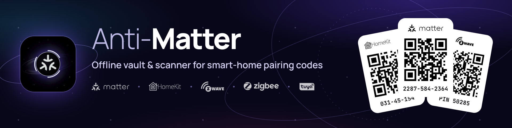
</p>

<h1 align="center">Anti-Matter</h1>

<p align="center">
  <b>A private vault for every Matter, HomeKit, Z-Wave, Zigbee and Tuya pairing code you own, with a fast offline scanner, living inside Home Assistant.</b>
</p>

<p align="center">
  <a href="anti_matter/CHANGELOG.md"></a>
  <a href="LICENSE"></a>
  
  
  
  <a href="#languages"></a>
</p>

<p align="center">
  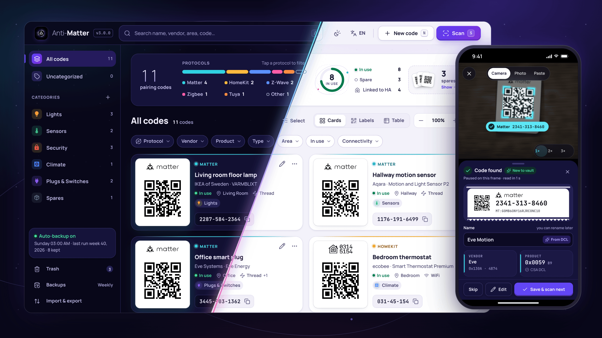
</p>

<p align="center">
  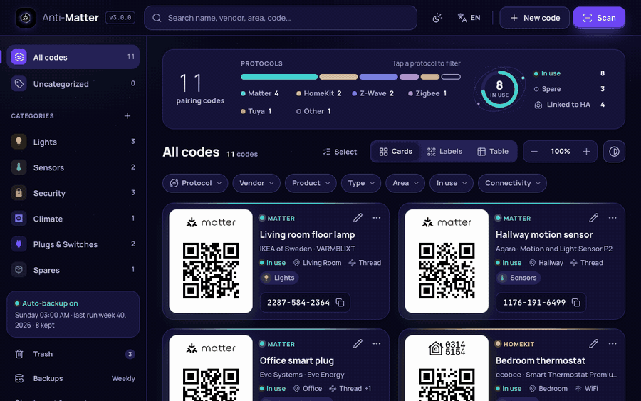<br>
  <sub>Scan a label, save it, point at the next one. Every code shown in these images is fake.</sub>
</p>

## Why Anti-Matter

The QR sticker you need to re-pair a device is always somewhere inconvenient. It might be on the back of a
fridge, on a box that went to recycling, or in a manual nobody can find. You need that code again after a
factory reset, when you move to a new controller, or when you add a Matter device to a second ecosystem.

Anti-Matter keeps all of those codes in one place in Home Assistant:

- **Scan once, keep forever.** Scan the label with any phone or webcam, or drop in a photo. It is decoded, checked and stored in seconds.
- **Show it again anywhere.** Every code gets a clean, scannable label. You can present it full screen, print it or download it.
- **Stays on your system.** The vault is a JSON file in the add-on's own folder. It is included in Home Assistant backups and reachable over Samba. There is no account and no cloud sync.

## Highlights

<table>
  <tr>
    <td width="50%" valign="top">
      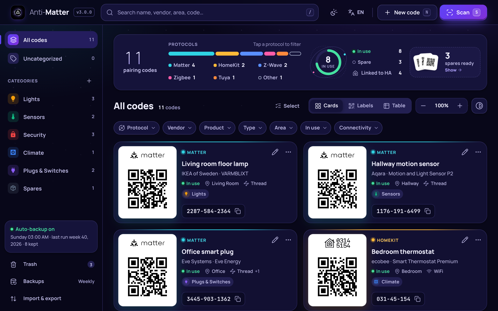<br>
      <b>Cards, labels or a table.</b> Browse your codes as cards with a live QR, as a wall of printable labels, or as a sortable table. A summary at the top counts codes per protocol, in use and spare.
    </td>
    <td width="50%" valign="top">
      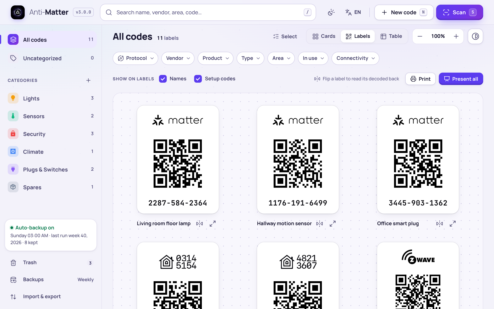<br>
      <b>Labels you can use.</b> Each protocol gets its own label with the official wordmark and a sharp QR code. Flip a label to read its decoded back, then print the set or present it full screen.
    </td>
  </tr>
  <tr>
    <td width="50%" valign="top">
      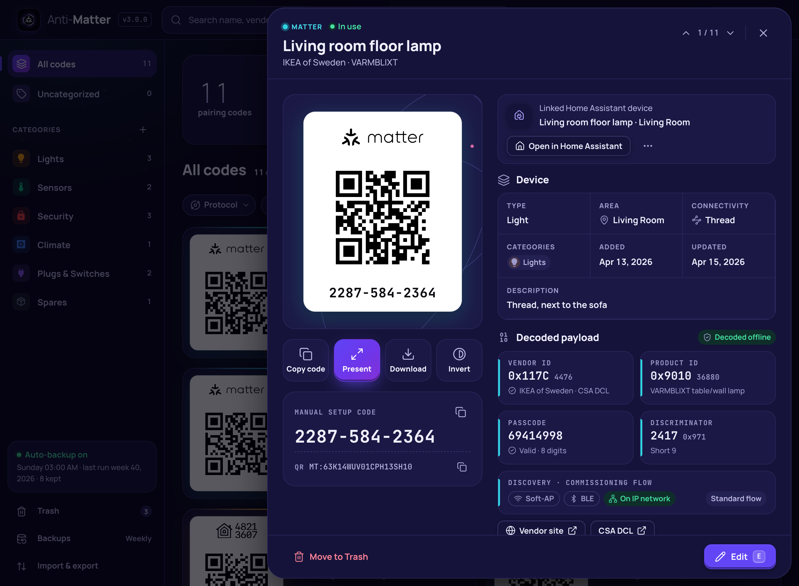<br>
      <b>Decoded, not just stored.</b> You see the vendor and product IDs, passcode, discriminator and discovery modes for Matter. For Z-Wave you see the security classes and the DSK with its PIN. Matter names come from the official CSA registry, and Z-Wave names from a bundled offline database.
    </td>
    <td width="50%" valign="top">
      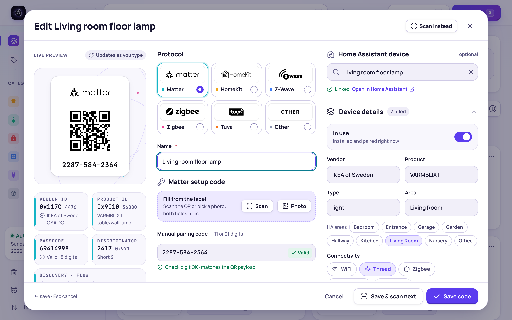<br>
      <b>An editor that checks your typing.</b> The label preview updates live as you type. Check digits are validated, and the manual code and QR are compared. You can pick a Home Assistant device to link and fill in vendor, product, area, type, connectivity and notes.
    </td>
  </tr>
  <tr>
    <td width="50%" valign="top">
      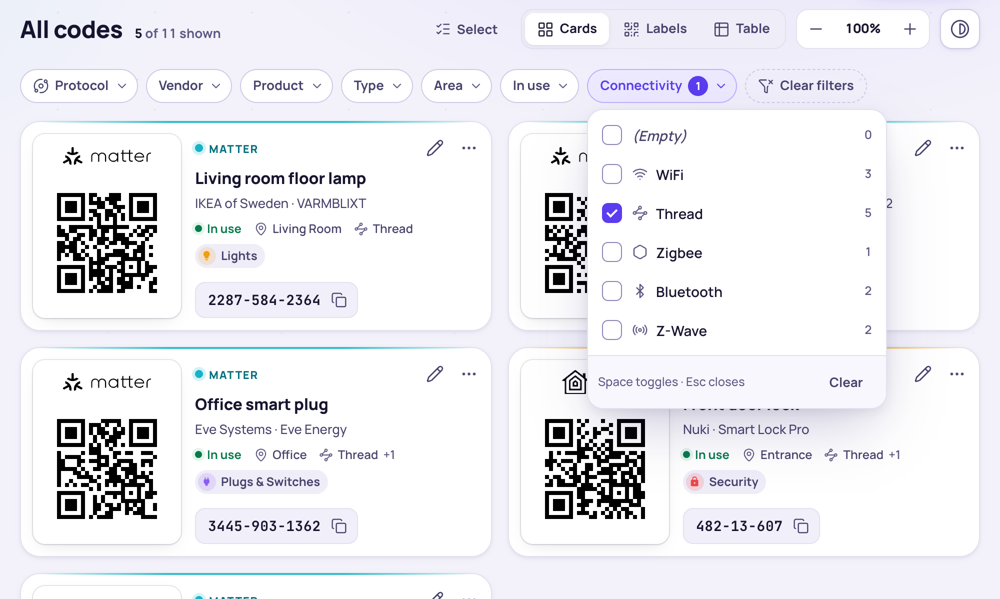<br>
      <b>Find anything.</b> Search covers names, vendors, areas, notes, codes and categories. Filters cover protocol, vendor, product, type, area, in use and connectivity. Colour-and-icon categories keep things grouped.
    </td>
    <td width="50%" valign="top">
      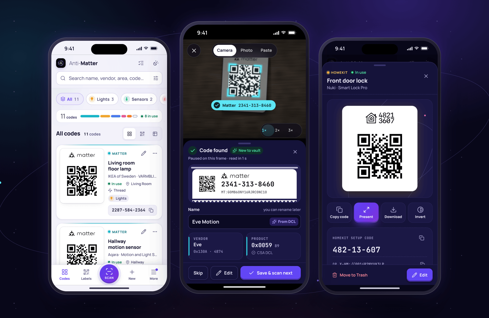<br>
      <b>Built for phones too.</b> On a phone you get a bottom dock with a big Scan button, bottom sheets you can swipe away, and 44 px touch targets. It also works in the Home Assistant Companion app, which can use its own native scanner.
    </td>
  </tr>
</table>

The add-on also includes:

- **Home Assistant device links.** Link a code to a device, get a suggested match for unlinked codes, and jump straight to the device page.
- **Trash with undo.** Deleted codes and categories wait in the Trash until you restore them or empty the bin.
- **Scheduled backups.** Back up hourly, daily, weekly or monthly, with automatic pruning. Export and import go through one JSON file.
- **Light, dark and Invert.** The theme follows Home Assistant, and Invert shows white-on-black QR codes for dark rooms. The whole app works by keyboard, mouse and touch.

## Scanning

Press **Scan** (or `S`). Anti-Matter picks the best scanner available:

| Where you are | What Scan does |
| --- | --- |
| **Home Assistant Companion app** (Android or iOS) | Opens the app's **native barcode scanner**. This works even when Home Assistant is on plain `http://`. |
| **Any browser on `https://`** | **Live camera** scanning, with the torch, zoom, tap-to-focus and camera switch where the device supports them. |
| **A browser on `http://`** | A **photo page**. Take a photo of the label, choose an image, drop one in, or paste a screenshot or text. |

**It works in every browser, offline.** Where the browser has a built-in QR detector (Chrome on Android, macOS and
ChromeOS), Anti-Matter uses it. Everywhere else, including Safari on iPhone and iPad, the iOS Companion app, Firefox,
and Chrome on Windows and Linux, it uses a bundled [zxing-wasm](https://github.com/Sec-ant/zxing-wasm) decoder that
runs in the background of your browser. Nothing is downloaded from the internet, and camera frames and photos never
leave your device.

**Why the camera needs HTTPS.** Browsers only allow camera access on secure (`https://`) pages. If you open Home
Assistant at an address like `http://homeassistant.local:8123`, the live camera cannot start. That is a browser rule
that Anti-Matter cannot change. You still have three good options:

1. Use the **Home Assistant Companion app**. Its native scanner works over `http://`.
2. Use **Photo**, **drop** or **paste**. On a phone, *Take photo* opens the camera app and the picture is decoded right away, offline.
3. Turn on HTTPS, for example with a Home Assistant Cloud remote URL or your own certificate. Then open Home Assistant at its `https://` address.

**Other scanning features:**

- **Batch scanning.** With *Keep scanning after saving* on, **Save & scan next** stores the code and goes straight back to the camera. A tray lists the session with **Undo**, and **Done** shows a summary with **Review**, which filters the vault to what you just scanned.
- **Several codes in one photo.** A photo of a whole box of labels shows every code it finds, numbered on the image. You tick the ones to save.
- **A decoder that keeps trying.** Hard photos get more passes: grayscale and contrast, inverted, upscaled, and tiled for large images. Screenshots work too.
- **Duplicate detection.** Anti-Matter checks each result against your vault before anything is saved. It recognises the same device even when its QR and its printed manual code look different. A duplicate is never saved twice, and **Open existing** takes you to the one you already have.
- **Nothing is rejected.** A code Anti-Matter does not recognise is saved as **Other**, exactly as scanned. A bare 8-digit number could be HomeKit or something else, so you are asked to choose.

<table>
  <tr>
    <td width="33%">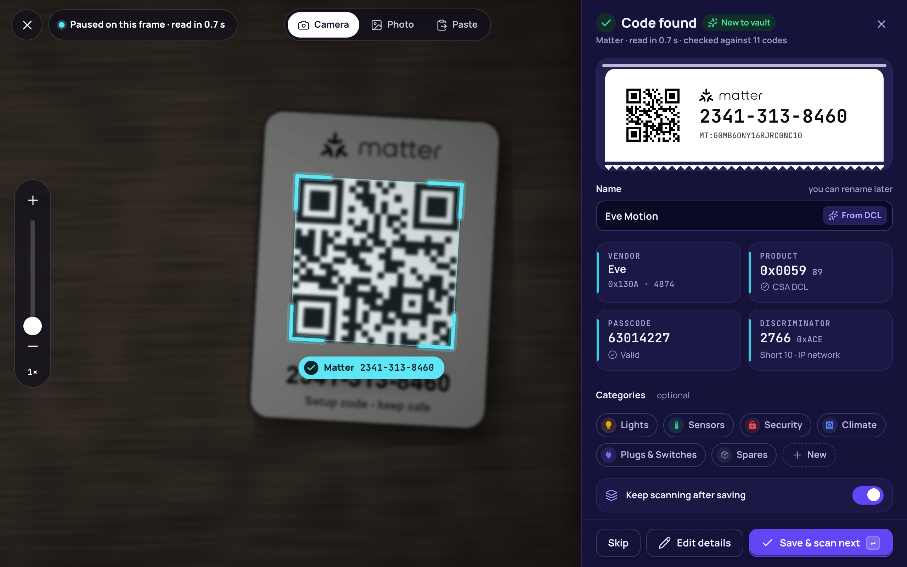</td>
    <td width="33%">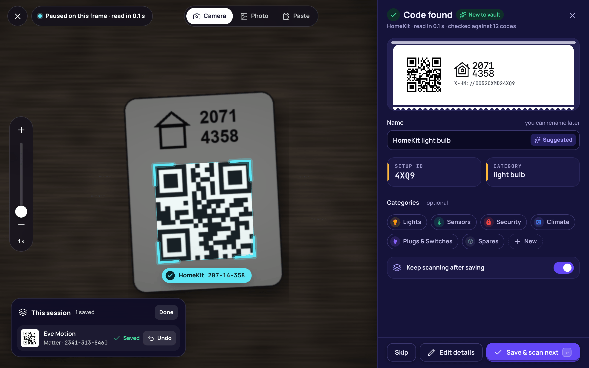</td>
    <td width="33%">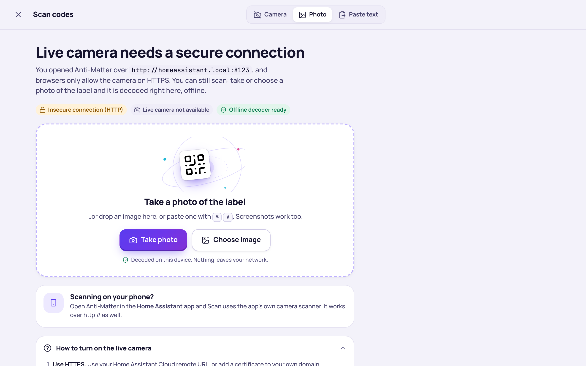</td>
  </tr>
  <tr>
    <td align="center"><sub>Live camera, locked on</sub></td>
    <td align="center"><sub>Result sheet and session tray</sub></td>
    <td align="center"><sub>On <code>http://</code>: photo, drop or paste</sub></td>
  </tr>
</table>

## Supported codes

| Protocol | Scan or type | Checked | Decoded |
| --- | --- | --- | --- |
| **Matter** | QR `MT:…`, or a manual pairing code of 11 or 21 digits | Check digit, payload structure, manual code against the QR | Vendor and product ID (with CSA DCL names), passcode, discriminator, discovery modes, commissioning flow. Multi-device `MT:…*…` payloads and extra TLV data are kept verbatim. |
| **HomeKit** | Setup URI `X-HM://…`, or an 8-digit pairing code `XXX-XX-XXX` | Pairing code against the URI. Scanned codes HomeKit forbids, such as `12345678`, are not taken as HomeKit. | Pairing code, setup ID, accessory category |
| **Z-Wave** | SmartStart QR (the long number starting with `90`), or a 40-digit DSK | QR checksum, DSK groups | PIN (the first 5 digits), S2/S0 security classes, Z-Wave / Long Range, manufacturer and product IDs, with names from the offline zwave-js device database |
| **Zigbee** | Install-code QRs in the formats ZHA understands (`Z:<EUI-64>$I:<code>`, `<EUI-64>\|<code>`, …) | Recognised format | EUI-64 and install code, stored verbatim |
| **Tuya** | Tuya and Smart Life links (`tuyasmart://`, `smartlife://`, Tuya / Smart Life web links) | Recognised format | Stored verbatim |
| **Other** | Anything else, such as Wyze labels or serial numbers | None | Stored exactly as entered, under a standard name you choose |

Zigbee and Tuya codes are stored as *Other* with the standard name "Zigbee" or "Tuya", so they get their own wordmark
and keep all their data.

## Languages

The app ships in 24 languages. **Auto** follows your Home Assistant language, and switches live when you change it
there. Without a Home Assistant language it follows the browser, then falls back to English. You can also pick a
language in the app (the language button, or **More → Language** on a phone). That choice is remembered by the
browser.

| Language | Code | Language | Code | Language | Code |
| --- | --- | --- | --- | --- | --- |
| English | `en` | Nederlands | `nl` | Українська | `uk` |
| Čeština | `cs` | Norsk bokmål | `nb` | עברית (right to left) | `he` |
| Dansk | `da` | Polski | `pl` | العربية (right to left) | `ar` |
| Deutsch | `de` | Português (Brasil) | `pt-BR` | 日本語 | `ja` |
| Español | `es` | Português (Portugal) | `pt` | 한국어 | `ko` |
| Français | `fr` | Suomi | `fi` | 简体中文 | `zh-Hans` |
| Italiano | `it` | Svenska | `sv` | 繁體中文 | `zh-Hant` |
| Magyar | `hu` | Türkçe | `tr` | Русский | `ru` |

Hebrew and Arabic mirror the whole layout. QR codes, setup codes and payloads always stay left to right, so they
read and scan correctly.

<p align="center">
  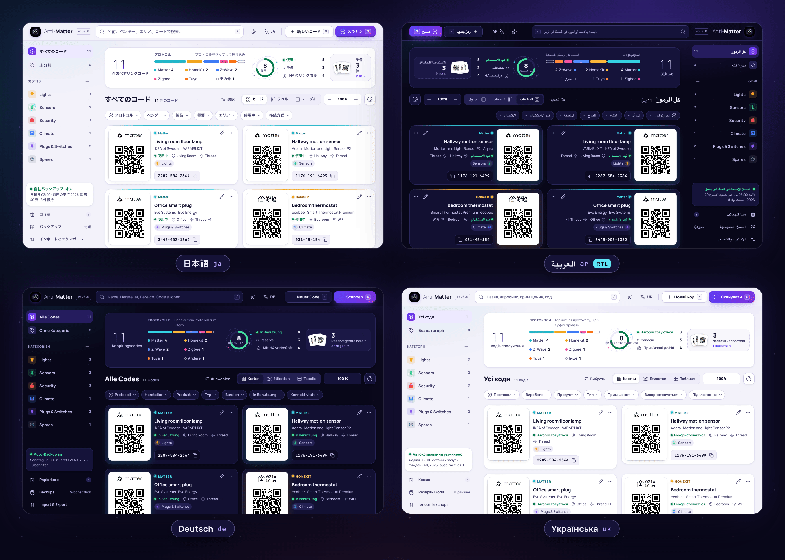
</p>

<details>
<summary><b>Improve a translation</b></summary>

Most of these translations are new in 3.0, and corrections from native speakers are very welcome.

- App text: [`anti_matter/app/static/locales/<code>.json`](anti_matter/app/static/locales/). Each file is one flat JSON
  object of `"key": "text"`. Keep `{placeholders}` exactly as they are. Plural forms are objects such as
  `{"one": "…", "other": "…"}`, using the CLDR categories of your language. A missing or empty key falls back to
  English, so partial files are fine.
- Configuration tab text: [`anti_matter/translations/<code>.yaml`](anti_matter/translations/).
- Reload the page to see your change; no build step is needed. Then open a pull request.

</details>

## Install

[](https://my.home-assistant.io/redirect/supervisor_add_addon_repository/?repository_url=https%3A%2F%2Fgithub.com%2FCl3tus%2FHA-Addons)

Or add the repository by hand:

1. In Home Assistant, go to **Settings → Apps → App store**, open the **⋮** menu (top right) and choose **Repositories**.
2. Add `https://github.com/Cl3tus/HA-Addons` and close the dialog.
3. Find **Anti-Matter** in the store, select **Install**, then **Start**.
4. Open **Anti-Matter** from the sidebar. It runs through Home Assistant ingress, so no ports are opened.

> [!NOTE]
> Older Home Assistant versions call these menus **Settings → Add-ons → Add-on Store**. The steps are otherwise the same.

**Requirements**

- Home Assistant OS or a Supervised install; apps (add-ons) need the Supervisor. The add-on uses the current `app_config` folder mapping, so keep the Supervisor up to date.
- A 64-bit system: **aarch64** (for example a Raspberry Pi 4 or 5 on 64-bit Home Assistant OS) or **amd64**. 32-bit systems are not supported.
- The container is built on your machine during install and update, which can take a few minutes on a Raspberry Pi.

## Configuration

Set these on the add-on's **Configuration** tab:

| Option | Values | Default | What it does |
| --- | --- | --- | --- |
| **Language** | `Auto` or any of the 24 languages, listed by their own names | `Auto` | Default app language. `Auto` follows Home Assistant, then the browser. A language picked in the app wins in that browser. |
| **Theme** | `Auto`, `Light`, `Dark` | `Auto` | Default theme. `Auto` follows Home Assistant's light or dark mode. A theme picked in the app's **Display** menu wins in that browser. |
| **Backups to keep** | 1–100 | 10 | Starting value for the backup schedule. After you save the in-app **Backups** dialog once, the value set there is used and this option is ignored. |

## Keyboard shortcuts

Press `?` in the app for the full list. Single-letter shortcuts are ignored while you type in a field. Every
shortcut also has a button, and there is a touch equivalent for every action.

<details>
<summary><b>Show all shortcuts</b></summary>

| Key | Action |
| --- | --- |
| `/` | Search |
| `S` / `N` | Scan / New code |
| `1` `2` `3` | Cards / Labels / Table |
| `Ctrl` or `⌘` + `+` `−` `0` | Grid size larger, smaller, reset (cards and labels) |
| `I` | Invert QR codes |
| Arrow keys | Move between cards or table rows |
| `Enter` | Open the details of the focused code |
| `E` / `C` / `P` | Edit / copy the setup code / present full screen |
| `D` / `Shift`+`D` | Decode the payload / download the label |
| `X` | Select the focused code |
| `Ctrl` or `⌘` + `A` | Select all shown codes (while selecting) |
| `Del` | Move to Trash |
| `F` | Flip the focused label |
| `↑` `↓` or `K` `J` | Previous / next code in the details |
| `←` `→` | Previous / next code when presenting |
| `Esc` | Close, cancel, or clear the selection |
| `?` | Show the shortcuts |
| **In the editor:** `Enter` or `Ctrl`/`⌘`+`Enter` | Save |
| **In the scanner:** `Enter` / `Esc` | Main action on the result / skip it or close |
| **In the scanner:** `T`, `C`, `+` `−` | Torch, switch camera, zoom |
| **In the scanner:** `1` `2` `3` | Camera / Photo / Paste |
| `Ctrl` or `⌘` + `V` | Paste an image (or, in the scanner, text) to scan it |

With the mouse, `Ctrl`/`⌘`-click toggles a code, `Shift`-click selects a range in the order shown (also in a sorted
table), and `Ctrl`/`⌘`+`Shift`-click adds a range. Right-click a card, row or category for its menu. On a Mac,
`Ctrl`-click selects like `⌘`-click. On touch screens, long-press a card or tap **Select** to start selecting.

</details>

## Storage & backups

Everything lives in the add-on's config folder, `/config` inside the add-on. Over Samba it is at:

```text
\\<HA-IP>\app_configs\<hash>_anti_matter\
├── anti_matter.json            your vault
├── anti-matter-bin.json        the Trash
├── backup_settings.json        the in-app backup schedule
└── backups/
    └── anti_matter_YYYYMMDD_HHMMSS.json   one file per backup (UTC time)
```

- `<hash>` is set by Home Assistant from the repository you installed from. For `Cl3tus/HA-Addons` it is `74e2a2e6`, so look for the folder ending in `_anti_matter`. Older setups name the share `addon_configs`.
- **Home Assistant backups** include this folder whenever the Anti-Matter add-on is part of the backup.
- **Backups dialog:** switch on automatic backups (hourly, daily, weekly or monthly), choose the time, and choose how many copies to keep (1–100). Older copies are pruned. **Back up now** makes one immediately. The schedule uses the add-on's local time; file names use UTC.
- **Export** downloads `anti-matter-export.json`, which holds every code and category. **Import** shows what a file contains, then offers **Merge** (add the new codes, keep yours) or **Replace** (a safety backup is made first). Files that are not Anti-Matter exports are refused.
- **Download label** saves a PNG to your device and also copies it to Home Assistant's media folder as `media/anti_matter/antimatter-<name>.png`.
- Backups and exports contain the vault only. The Trash is not included.

## Privacy & security

- **Your codes stay local.** The vault, the Trash and the backups are plain JSON files on your Home Assistant. They are not encrypted, so treat the Samba share, Home Assistant backups and exported files like a password list.
- **One optional outbound request.** When you open, edit or scan a **Matter** code, the add-on asks the official CSA Distributed Compliance Ledger (`on.dcl.csa-iot.org`) for the vendor and product name. Only the vendor ID and product ID are sent: never the passcode, the QR payload or anything else. The request comes from the add-on itself, not your browser. It is best-effort: when there is no internet, names are simply missing. There is no switch to turn it off, but blocking internet access for the add-on is harmless.
- **Everything else is offline.** Z-Wave names come from a bundled copy of the zwave-js device database. The QR decoder, fonts and icons are bundled, so nothing loads from a CDN. There is no telemetry, no analytics, no account and no cloud. External links (vendor site, CSA DCL, zwave-js) open only when you click them.
- **Home Assistant access is read-only in practice.** The add-on reads your device list and areas to suggest links. It never changes anything in Home Assistant.
- **Who can see the codes: every Home Assistant user.** The panel is registered for all users, admins or not (`panel_admin: false`). Anyone who can log in to Home Assistant can open the vault and read the pairing codes. Only give Home Assistant accounts to people you would trust with these codes. Turning off **Show in sidebar** on the add-on's page hides the panel, but it is not a security boundary. There is no admin-only option yet.
- **Logs never contain your codes.** Pairing codes and payloads are redacted from the add-on log.

<details>
<summary><b>For power users</b></summary>

The add-on's API has no login of its own. It relies on Home Assistant ingress for authentication, and no port is
published to your network. Other add-ons on the Supervisor's internal network can reach it on port 8099. The Matter
lookup uses a 6-second timeout, and its answers are cached by the page for the session.

</details>

## Upgrading from 2.x

Update from the app store as usual. Taking a **Back up now** first is a good habit.

- **Nothing to migrate** when you update in place. Your vault, Trash, backups, schedule and options are used as they are. The option values `Auto`, `English` and `Nederlands` are still valid. Installing from a *different* repository is not an update: see [Switching repositories](#switching-repositories).
- **HomeKit pairing codes are repaired once.** Versions before 3.0 decoded some `X-HM://` setup URIs with the wrong bit mask, which gave the wrong 8 digits. On first start, 3.0 fixes every saved HomeKit code (in the vault and in the Trash) whose digits exactly match that old mistake. Codes you typed yourself are never touched.
- **Stricter duplicate detection.** Anti-Matter now also recognises the same device across its QR and its manual code, and across a Z-Wave QR and its DSK. If your vault already holds the same device twice, both entries stay. Saving a change to either one (including linking it to a Home Assistant device) shows *Already saved as…* until you move the extra copy to the Trash.
- **Different clicks.** A click or tap on a card or table row opens its details; double-clicking is no longer needed. Right-click opens the actions menu instead of the editor. Each card has a pencil button, and `E` opens the editor.
- **Choices are remembered.** Language and theme picked in the app are now kept per browser. Before, they reset on reload.
- **Downloads are PNG for every protocol.** HomeKit and Z-Wave labels were SVG before.

See the [changelog](anti_matter/CHANGELOG.md) for the full list.

### Switching repositories

Home Assistant treats Anti-Matter from another repository (for example a fork instead of `Cl3tus/HA-Addons`) as a
separate add-on, with its own empty config folder. Your old vault stays where it was. Bring it over in one of two
ways:

- **Export and import** (the vault): in the old Anti-Matter, click **Export**. In the new one, choose **Import a
  JSON export** on the empty vault, pick `anti-matter-export.json` and confirm. A file from the old `backups/`
  folder, or the old `anti_matter.json` itself, imports the same way.
- **Copy the folder** (everything, including the Trash, backups and schedule): stop the new add-on, copy
  `anti_matter.json`, `anti-matter-bin.json`, `backup_settings.json` and `backups/` from the old
  `…_anti_matter` folder to the new one over Samba (see [Storage & backups](#storage--backups)), then start it.

Either way, HomeKit codes from 2.x are repaired. Add-on options such as language and theme are not carried over,
so set them again on the Configuration tab. When everything is there, uninstall the old add-on.

## Development

<details>
<summary><b>Run it locally, test it, make screenshots</b></summary>

The back end is FastAPI (`anti_matter/app/main.py`). The UI is plain JavaScript and CSS in
`anti_matter/app/static/`, with no build step and every asset vendored.

```sh
python3 -m venv .venv && .venv/bin/pip install -r anti_matter/app/requirements.txt pytest
mkdir -p /tmp/am/config /tmp/am/media
STORAGE_DIR=/tmp/am/config ANTIMATTER_DATA=/tmp/am ANTIMATTER_OPTIONS=/tmp/am/options.json \
ANTIMATTER_MEDIA=/tmp/am/media .venv/bin/python anti_matter/app/main.py
# open http://localhost:8099 (localhost counts as secure, so the camera works)
```

Outside Home Assistant, the device and area features are simply off.

- **Back-end tests:** `cd anti_matter && ../.venv/bin/python -m pytest -q tests`
- **Screenshots:** [`tools/screenshots`](tools/screenshots/README.md) regenerates every README and wiki image, the GIF and the banner from the real UI with a fake demo vault (`npm install`, then `node capture.mjs`).
- **Z-Wave device names:** `anti_matter/tools/build_zwave_device_db.py` refreshes the bundled zwave-js snapshot.
- **Checks:** `python3 tools/ci/version.py check` (the version matches everywhere), `python3 tools/ci/check_i18n.py --locales` (translation keys, placeholders, plurals) and a browser smoke test (`cd tools/ci && npm ci && npx playwright install chromium && node smoke.mjs`).
- **CI:** every push and pull request runs the add-on linter, those checks, the back-end tests, the smoke test and a Docker build for amd64 and aarch64 ([`.github/workflows/ci.yml`](.github/workflows/ci.yml)).
- **Releasing:** run `python3 tools/ci/version.py bump X.Y.Z`, which updates every copy of the version and adds a CHANGELOG stub. Fill in the CHANGELOG entry and push to `main`. [`release.yml`](.github/workflows/release.yml) then runs CI, tags `vX.Y.Z`, publishes a GitHub release with that CHANGELOG section, and mirrors `anti_matter/` into [HA-Addons](https://github.com/Cl3tus/HA-Addons). The mirror step needs a `HA_ADDONS_TOKEN` secret: a fine-grained token with *Contents: read and write* on the HA-Addons repository. Without it the release is still made and the mirror step is skipped with a warning. The `HA_ADDONS_REPO` repository variable overrides the target.

</details>

## Credits

Anti-Matter is a rewrite of [Rematters](https://github.com/Rematters/Rematters-HA) by Jesse Hulswit
([JesseFPV](https://rematters.casa/)), reworked into a cloud-free, local-only add-on. Full credit to Jesse for the
original Rematters add-on and its design.

This repository is a fork of [Cl3tus/Anti-Matter-HA](https://github.com/Cl3tus/Anti-Matter-HA). Since its 2.0.5
release, about **82% of the code is new or updated**: a rebuilt interface and scanner, 24 languages, tests, and CI
and release automation. The figure counts hand-written code only, not translations, docs or vendored libraries. The
backend is still largely Cl3tus's work.

Anti-Matter builds on [zxing-wasm](https://github.com/Sec-ant/zxing-wasm) (MIT) and
[zxing-cpp](https://github.com/zxing-cpp/zxing-cpp) (Apache-2.0), [Lucide](https://lucide.dev) icons (ISC),
[Material Design Icons](https://pictogrammers.com/library/mdi/) (Pictogrammers Free License), the Manrope and
JetBrains Mono fonts (SIL OFL 1.1), the [zwave-js](https://github.com/zwave-js/node-zwave-js) device database (MIT),
[FastAPI](https://fastapi.tiangolo.com) and [python-qrcode](https://github.com/lincolnloop/python-qrcode). Their
licence files ship next to the vendored copies.

## Trademarks

Matter, HomeKit, Z-Wave, Zigbee and Tuya (and their logos) are trademarks of their respective owners: the
Connectivity Standards Alliance, Apple Inc., the Z-Wave Alliance and Tuya Inc. They are used only to identify the
protocols a code belongs to. Anti-Matter is an independent project and is not affiliated with or endorsed by any of
them.

## License

MIT. See [LICENSE](LICENSE).
